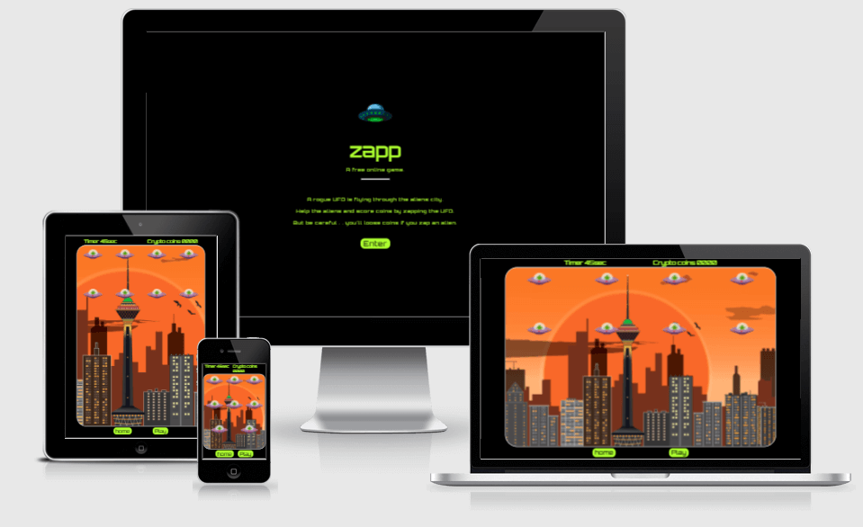

# zapp

zapp is a free online game. The game is designed to be an easy to use and fun game where users can enjoy the challenge of zapping an animated UFO. The game is styled with a retro arcade game theme and brings the sounds and feel of an old arcade game to mobile, tablet, laptop and desktop for anyone to enjoy.

Enjoy [zapp](https://davecaulfield.github.io/zapp/)

# User Experience (UX)
- The user experience (UX) and user interface (UI) was considered from the start of the design process. The game aims to give the user an enjoyable experience whilst easily and intuitively navigating and playing the game on mobile, tablet, laptop or desktop devices.

## Wireframes
- TO BE ADDED

[Back to top](#zapp)

## Site Structure
The zapp game has two pages, a landing  [home](index.html) page to greet the user and a [game](game.html) page to play the game.

[Back to top](#zapp)

## Design Choices

### Typography
The fonts used are Orbitron with a fallback of verdana.
   *  The Orbitron font gives the game both an old sci-fi spacecraft style and a retro arcade game style.
   
### Colour scheme
   * The colour scheme used is black (#000000) for the background and greenyellow (#ADFF2F) for text. A contrasting warm orange and brown graphic is used for the background to the game page.
   * The black background of the landing page gives a premium feel to the site. It helps immediatley convey the theme of the game being set in space to the user. 
   * Black is also used to frame the game on the game page and mimics an old Arcade game screen adding to the users experience. 
   * The greenyellow colour used for the text helps create the sci-fi spaceship retro arcade game style. The colour stands out on the black background an is clearly readible to the user throughout the site.
   * The warm orange and brown graphic used as the background to the game area also contrasts with the black frame and gives a warm welcoming feeling to the user.

[Back to top](#zapp)

# Features

The zapp game is designed to be a fun game to play. It is designed to be as intuitive as as possible for the user for both navigating and playing the game. The theme is that of an old shoot `em up video arcade game set in space and aims to bring the look, feel and sounds of a classic arcade game to the user.

## Existing Features

### The landing page
   - The landing page has a black background colour and displays a small image of a UFO. 
   - The name of the game zapp is in large greenyellow font and has a tag line explaining to the user that this is a free online game. 
   - A brief description of the games storyline and what to do explains immediatley to the user what the game is about.
   - A call to action enter button invites the user to take the next step. The button changes to white when hovered on.
   - The landing page features combine to convey a clear message to the user of what the game is about and its theme. It is both welcoming and intuitive to the user.

   

