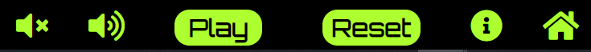

# zapp

zapp is a free online game. The game is designed to be an easy to use and fun game where users can enjoy the challenge of zapping an animated UFO. The game is styled with a retro arcade game theme and brings the sounds and feel of an old arcade game to mobile, tablet, laptop and desktop for anyone to enjoy.

Play [zapp](https://davecaulfield.github.io/zapp/)

# User Experience (UX)
- The user experience (UX) and user interface (UI) was considered from the start of the design process. The game aims to give the user an enjoyable experience whilst easily and intuitively navigating and playing the game on mobile, tablet, laptop or desktop devices.

## Wireframe

-  

[Back to top](#zapp)

## Site Structure
The zapp game has two pages, a landing  [home](index.html) page to greet the user and a [game](game.html) page to play the game.

[Back to top](#zapp)

## Design Choices

### Typography
The fonts used are Orbitron with a fallback of verdana.
   *  The Orbitron font gives the game a space sci-fi and retro arcade game style.
   
### Colour scheme
   * The colour scheme used is black (#000000) for the background and greenyellow (#ADFF2F) for text. A contrasting warm orange and brown graphic is used for the background to the game page.
   * The black background of the landing page gives a premium feel to the site. It immediatley helps convey the theme of the game being set in space to the user. 
   * Black is also used to frame the game on the game page and mimics an old Arcade game screen adding to the users experience. 
   * The greenyellow colour used for the text helps create the sci-fi spaceship retro arcade game style. The colour stands out on the black background an is clearly readible to the user throughout the site.
   * The warm orange and brown graphic used as the background to the game area also contrasts with the black frame and gives a warm welcoming feeling to the user.

[Back to top](#zapp)

# Features

The zapp game is designed to be a fun game to play for all ages. It is designed to be as intuitive as as possible for the user in both navigating and playing the game. The theme is that of an classic shoot `em up video arcade game set in space and aims to bring the look, feel and sounds of a classic arcade game to the user.

## Existing Features

### The landing page
   - The landing page has a black background colour and displays a small image of the UFO. 
   - The name of the game zapp is in large greenyellow font and has a tag line explaining to the user that this is a free online game. 
   - A brief description of the games storyline and what to do explains immediatley to the user what the game is about.
   - A call to action enter button invites the user to take the next step. The button changes to white when hovered on.
   - The landing page features combine to convey a clear message to the user of what the game is about and its theme. It is both welcoming and intuitive to the user.

   

[Back to top](#zapp)

### The Timer
 - The timer displays the amount of time the user has in the game. 
 - It displays the count down in seconds to the user as it counts down from a starting time of 45 seconds. 
 - It is immediatley clear to the user how much time they have when starting the game and also their remaining time throughout the game.

   

[Back to top](#zapp)

### The scoreboard 
- The scoreboard displays the users score in crypto coins.
- It is clearly visible as the user plays the game.
- The score increments by 1000 coins when the user successfuuly zaps the UFO.
- The score decrements by 1000 coins if the user zaps an alien.
- The use of crypto coins as a measure of score and the high numbers involved adds fun to the user experience.

[Back to top](#zapp)

### The game area
- The background graphic of the game area cosists of a warm orange and brown animation of a city skyline with a large futuristic skycraper tower.
- The colours are fun, warm and welcoming to the user.
- The game area is framed to look like an arcade game screen to enhance the user experience.
- The friendly alien characters are displayed at the start of the game greeting the user.
- The alien spaceships flash on and off the screen.
- The target UFO then appears in a random position with every flash on screen.
- The game area images support the theme of fun to the user.

[Back to top](#zapp)

### The game area buttons
- The buttons under the game area keep the style consistent for the user.
- The Home button brings the user back to the landing page.
- The Play button allows the user to start the game.
- Audios icons allow the user to turn the music off and on.
- The reset button allows the user to reset the game at any point.
- All buttons and icons change background colour to white when hovered on.
- All buttons and icons are clear and easily understood by the user makng it an immediately intuitive experience.

[Back to top](#zapp)

### Audio
- Game theme music plays when the user starts a game. 
- Sound effects play when the user zaps the UFO. This feature indicates to the user that they have successfully zapped the UFO and their score has incremented.
- A different sound effect plays if the user zaps an alien. This feature indicates to the user their score has decremented.
- The sounds of arcade game music and various interactive sound effects enhance the experience for the user.

[Back to top](#zapp)

## Future Features
  - A Multi level feature where the player has to score a certain amount of points to progress to the next level.
  - Different graphics or charaters on each level.

[Back to top](#zapp)

  # Technologies Used

  - [HTML](https://html.spec.whatwg.org/) was used to structure the website.
  - [CSS](https://www.w3.org/Style/CSS/Overview.en.html) was used to style the website.
  - [Javascript](https://www.ecma-international.org/publications-and-standards/standards/ecma-262/) was used to run the game.
  - [Gitpod](https://www.gitpod.io/#get-started) was used to create and edit the website files.
  - [Github](https://github.com/) was used to host and deploy the website.

[Back to top](#zapp)

# Testing

Please see the [testing](testing.md) page for details of MKG North Dublin website testing. 

 [Back to top](#zapp) 

# Deployment

 ## To deploy the site
 The site was deployed to GitHub pages. The steps to deploy are as follows:

 1. In the Github repository select the **Settings** tab.

  

 2. Select the **pages** tab on the left of screen.

  

 3. In the **source** section select the branch drop down and set to **main**, then click **save**.

  

4. Once you select save the page will refresh and a link to the published site will be displayed.   

  

  ## To fork the repository on Github

A fork is a copy of a repository. Forking a repository allows you to freely experiment with changes without affecting the original project.

1. In the Github repository select the **fork** button on the top right of screen. This will create a copy of the original repository to your github account.

## To clone the repository

Cloning the repository creates a local copy on your computer.

1. In the Github repository select the **code** tab.
2. In the **clone https** section select the clipboard icon.

3. Open **Git Bash** terminal in your IDE.
4. Create or go to the directory for the cloned repository.
5. Enter command **git clone** and paste the URL copied from GitHub.
6. Press **enter** and the local clone will be created.

 [Back to top](#zapp) 

  # Credits

 ## Content
 - The wireframe was created using [Balsamiq](https://balsamiq.com/wireframes/)
 - The font came from [GoogleFonts](https://fonts.google.com/)
 - The background image for the game area came from [Max Pixel](https://www.maxpixel.net//)
 - The images for the UFO and aliens came from [Pixabay](https://pixabay.com/)
 - images were compressed using [Compressor](https://compressor.io/) and [Tinypng](https://tinypng.com/)
 - The idea and code structure for the flashing elements came from kids coding book [getcoding](https://getcodingkids.com/)
 - The mp3 audio files came from [Zapsplat](https://www.zapsplat.com/)
  
 [Back to top](#zapp)

  # Acknowledgements

   The zapp game was built as my Portfolio 2 Project for the Full Stack Software Developer (e-Commerce) Diploma at the [Code Institute](https://codeinstitute.net/ie/). I would like to thank my cohort facilitator [Kasia Bogucka](https://github.com/bezebee), my mentor [Precious Leige](https://www.linkedin.com/in/precious-ijege-908a00168/), the Slack community particulary Gregg Commins and all at the Code institute for the help and support provided to me throughout this project. 
